# Jarkom-Modul-4-C06

## Anggota Kelompok
1. 5025201050 - Elshe Erviana Angely
2. 5025201051 - Muhammad Fath Mushaffa Azhar
3. 5025201076 - Raul Ilma Rajasa

## VLSM - Cisco Packet Tracer
Untuk membuat VLSM, pertama-tama, kita perlu membuat tabel yang berisi jumlah IP pada setiap subnet beserta totalnya
### Tabel Subnet
| Subnet | Jumlah IP | Netmask |
| --- | --- | --- |
| A1 | 2 | /30 |
| A2 | 251 | /24 |
| A3 | 121 | /25 |
| A4 | 71 | /25 |
| A5 | 2 | /30 |
| A6 | 1001 | /22 |
| A7 | 212 | /24 |
| A8 | 501 | /23 |
| A9 | 2 | /30 |
| A10 | 51 | /26 |
| A11 | 271 | /23 |
| A12 | 2 | /30 |
| A13 | 2 | /30 |
| A14 | 121 | /25 |
| A15 | 2 | /30 |
| A16 | 2 | /30 |
| A17 | 2 | /30 |
| A18 | 2 | /30 |
| Total | 2618 | /20 |

### VLSM Tree
Sehingga proyeksi tree dari VLSM-nya adalah sebagai berikut:
.jpg)

### Pembagian IP
| Subnet | Network ID | Netmask | Broadcast |
| --- | --- | --- | --- |
| A1 | 192.182.0.0 | 255.255.255.252 | 192.182.0.3 |
| A2 | 192.182.1.0 | 255.255.255.0 | 192.182.1.255 |
| A3 | 192.182.0.128 | 255.255.255.128 | 192.182.0.255 |
| A4 | 192.182.4.128 | 255.255.255.128 | 192.182.4.255 |
| A5 | 192.182.0.4 | 255.255.255.252 | 192.182.0.7 |
| A6 | 192.182.8.0 | 255.255.252.0 | 192.182.11.255 |
| A7 | 192.182.5.0 | 255.255.255.0 | 192.182.5.255 |
| A8 | 192.182.2.0 | 255.255.254.0 | 192.182.3.255 |
| A9 | 192.182.0.16 | 255.255.255.252 | 192.182.0.19 |
| A10 | 192.182.0.64 | 255.255.255.192 | 192.182.0.127 |
| A11 | 192.182.6.0 | 255.255.254.0 | 192.182.7.255 |
| A12 | 192.182.0.8 | 255.255.255.252 | 192.182.0.11 |
| A13 | 192.182.0.12 | 255.255.255.252 | 192.182.0.15 |
| A14 | 192.182.4.0 | 255.255.255.128 | 192.182.4.127 |
| A15 | 192.182.0.20 | 255.255.255.252 | 192.182.0.23 |
| A16 | 192.182.0.24 | 255.255.255.252 | 192.182.0.27 |
| A17 | 192.182.0.28 | 255.255.255.252 | 192.182.0.31 |
| A18 | 192.182.0.32 | 255.255.255.252 | 192.182.0.35 |

## Topologi - Cisco Packet Tracer
Dalam CPT, topologi dibuat seperti pada modul Jarkom 4, setelah itu setiap node (router, host) dikonfigurasi sesuai dengan subnet IP, sehingga node dan gateway IP berada dalam rentang IP yang dapat digunakan dari setiap subnet. Kemudian melakukan routing langsung dan routing statis untuk setiap router di topologi. Pengujian file .pkt dapat dilakukan dengan mengirimkan pesan dari satu node ke node lainnya
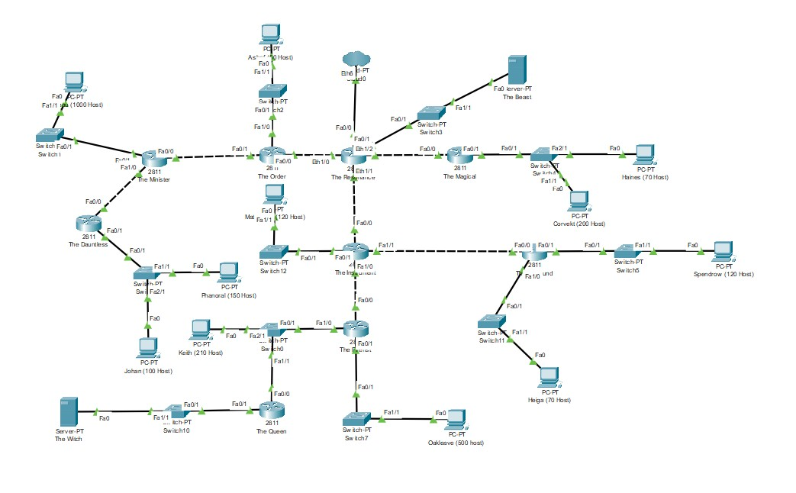

## CIDR - GNS 3

### Perhitungan Subnet

******************Langkah 1******************

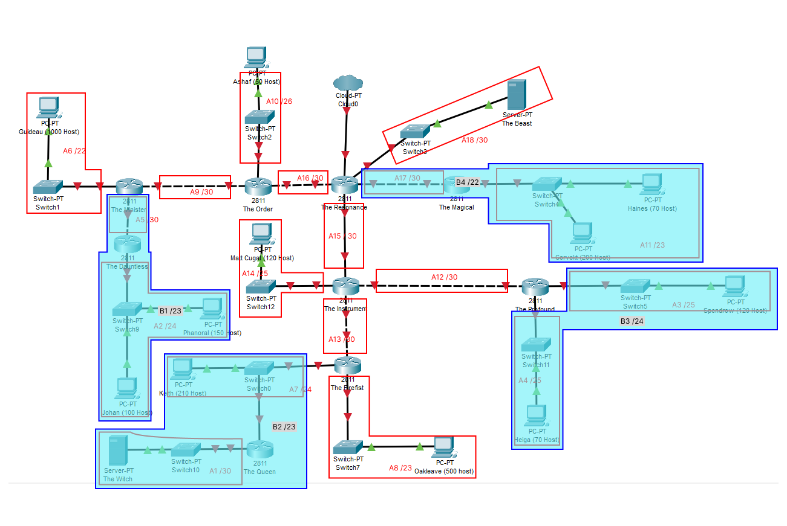

Penggabungan

Dari langkah 1 di atas, didapatkan penggabungan sebagai berikut: 

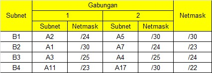

******************Langkah 2******************

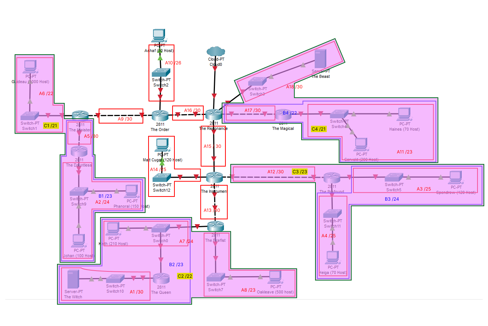

Dari langkah 2 di atas, didapatkan penggabungan sebagai berikut:

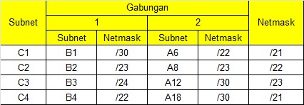

******************Langkah 3******************

Dari langkah 3 di atas, didapatkan penggabungan sebagai berikut:

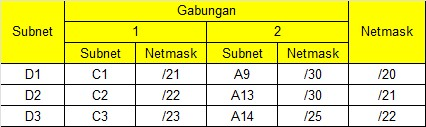

**************Langkah 4**************

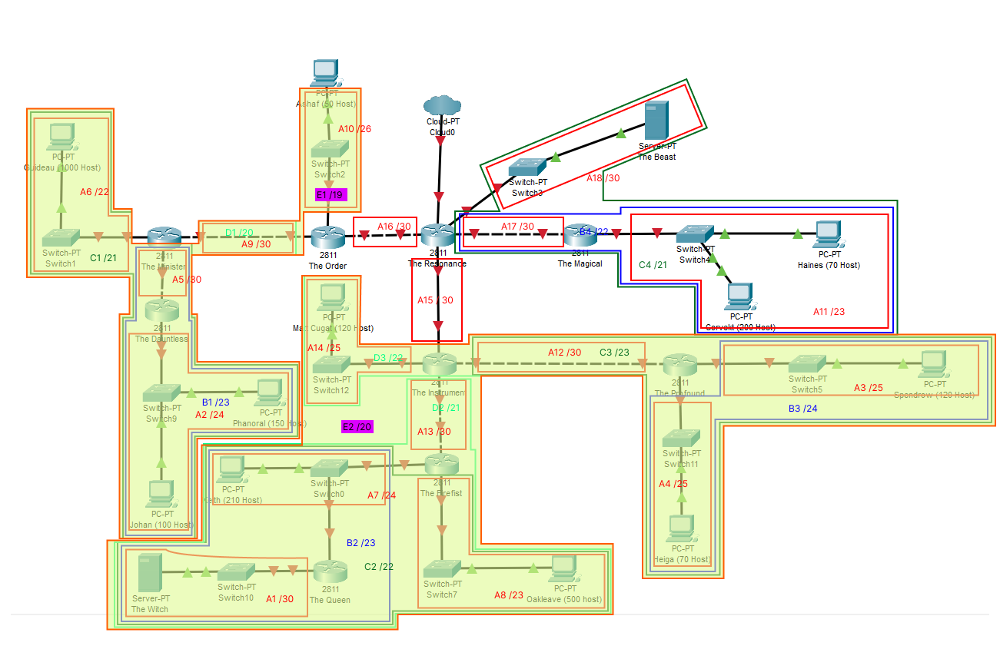

Dari langkah 4 di atas, didapatkan penggabungan sebagai berikut:

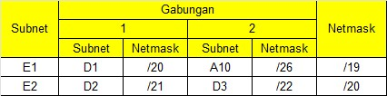

******************Langkah 5******************

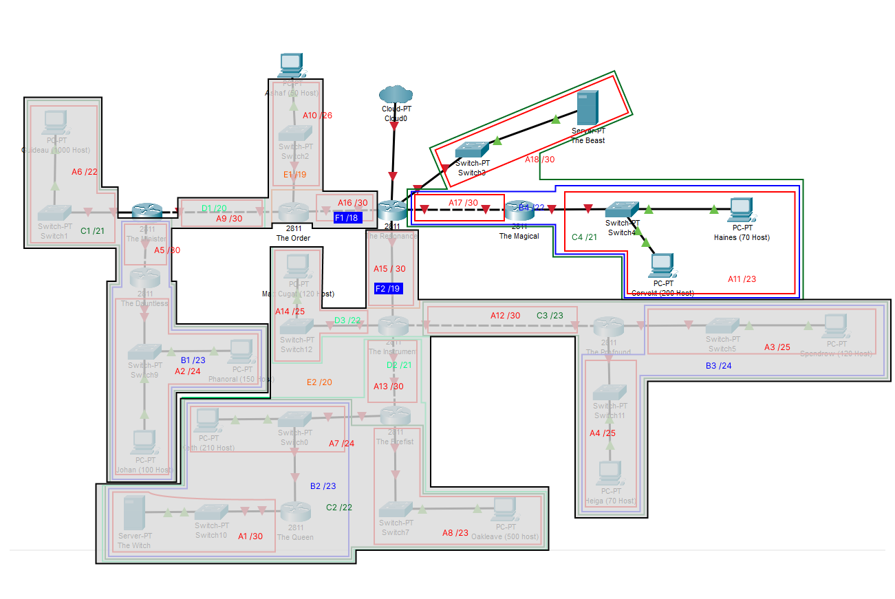

Dari langkah 5 di atas, didapatkan penggabungan sebagai berikut:

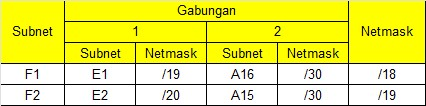

******************Langkah 6******************

Dari langkah 6 di atas, didapatkan penggabungan sebagai berikut:

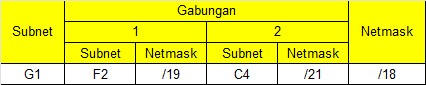

******************Langkah 7******************

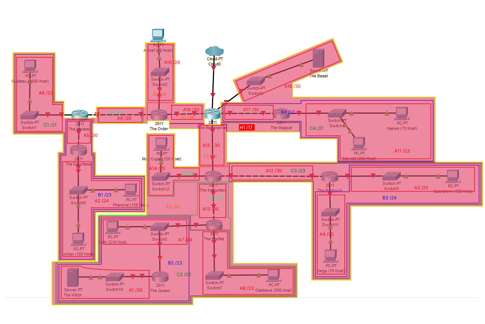

Dari langkah 7 di atas, didapatkan penggabungan sebagai berikut:

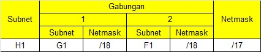

### Tree

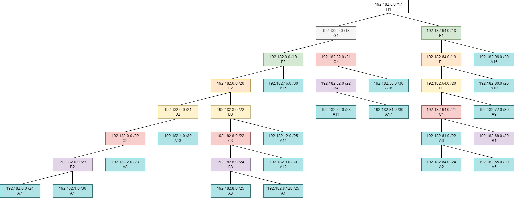

### Pembagian IP

| Subnet | Network ID | Netmask | Broadcast |
| --- | --- | --- | --- |
| A1 | 192.182.1.0 | 255.255.255.252 | 192.182.1.3 |
| A2 | 192.182.64.0 | 255.255.255.0 | 192.182.64.255 |
| A3 | 192.182.8.0 | 255.255.255.128 | 192.182.8.127 |
| A4 | 192.182.8.128 | 255.255.255.128 | 192.182.8.255 |
| A5 | 192.182.65.0 | 255.255.255.252 | 192.182.65.3 |
| A6 | 192.182.64.0 | 255.255.252.0 | 192.182.67.255 |
| A7 | 192.182.0.0 | 255.255.255.0 | 192.182.0.255 |
| A8 | 192.182.2.0 | 255.255.254.0 | 192.182.3.255 |
| A9 | 192.182.72.0 | 255.255.255.252 | 192.182.72.3 |
| A10 | 192.182.80.0 | 255.255.255.192 | 192.182.80.63 |
| A11 | 192.182.32.0 | 255.255.254.0 | 192.182.33.255 |
| A12 | 192.182.9.0 | 255.255.255.252 | 192.182.9.3 |
| A13 | 192.182.4.0 | 255.255.255.252 | 192.182.4.3 |
| A14 | 192.182.12.0 | 255.255.255.128 | 192.182.12.127 |
| A15 | 192.182.16.0 | 255.255.255.252 | 192.182.16.3 |
| A16 | 192.182.96.0 | 255.255.255.252 | 192.182.96.3 |
| A17 | 192.182.34.0 | 255.255.255.252 | 192.182.34.3 |
| A18 | 192.182.36.0 | 255.255.255.252 | 192.182.36.3 |

