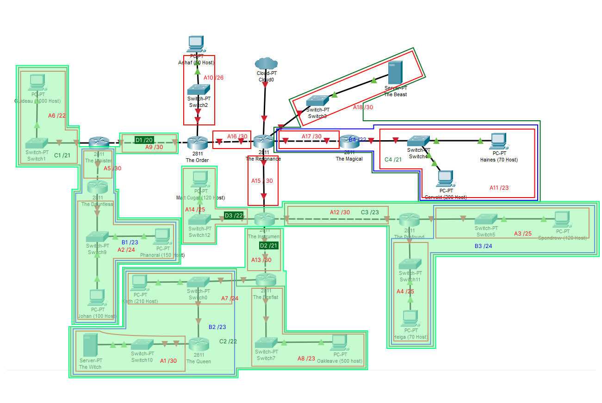
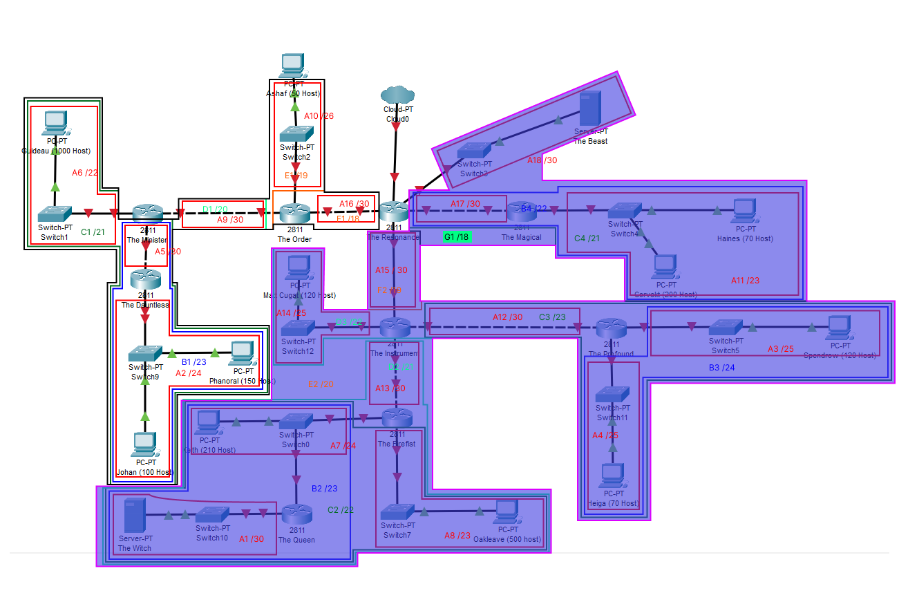

# Jarkom-Modul-4-C06

## Anggota Kelompok
1. 5025201050 - Elshe Erviana Angely
2. 5025201051 - Muhammad Fath Mushaffa Azhar
3. 5025201076 - Raul Ilma Rajasa

## CIDR - GNS 3

### Perhitungan Subnet

******************Langkah 1******************

Penggabungan

Dari langkah 1 di atas, didapatkan penggabungan sebagai berikut: 

******************Langkah 2******************

Dari langkah 2 di atas, didapatkan penggabungan sebagai berikut:

******************Langkah 3******************

Dari langkah 3 di atas, didapatkan penggabungan sebagai berikut:

**************Langkah 4**************

Dari langkah 4 di atas, didapatkan penggabungan sebagai berikut:

******************Langkah 5******************

Dari langkah 5 di atas, didapatkan penggabungan sebagai berikut:

******************Langkah 6******************

Dari langkah 6 di atas, didapatkan penggabungan sebagai berikut:

******************Langkah 7******************

Dari langkah 7 di atas, didapatkan penggabungan sebagai berikut:

### Tree

### Pembagian IP

| Subnet | Network ID | Netmask | Broadcast |
| --- | --- | --- | --- |
| A1 | 192.182.1.0 | 255.255.255.252 | 192.182.1.3 |
| A2 | 192.182.64.0 | 255.255.255.0 | 192.182.64.255 |
| A3 | 192.182.8.0 | 255.255.255.128 | 192.182.8.127 |
| A4 | 192.182.8.128 | 255.255.255.128 | 192.182.8.255 |
| A5 | 192.182.65.0 | 255.255.255.252 | 192.182.65.3 |
| A6 | 192.182.64.0 | 255.255.252.0 | 192.182.67.255 |
| A7 | 192.182.0.0 | 255.255.255.0 | 192.182.0.255 |
| A8 | 192.182.2.0 | 255.255.254.0 | 192.182.3.255 |
| A9 | 192.182.72.0 | 255.255.255.252 | 192.182.72.3 |
| A10 | 192.182.80.0 | 255.255.255.192 | 192.182.80.63 |
| A11 | 192.182.32.0 | 255.255.254.0 | 192.182.33.255 |
| A12 | 192.182.9.0 | 255.255.255.252 | 192.182.9.3 |
| A13 | 192.182.4.0 | 255.255.255.252 | 192.182.4.3 |
| A14 | 192.182.12.0 | 255.255.255.128 | 192.182.12.127 |
| A15 | 192.182.16.0 | 255.255.255.252 | 192.182.16.3 |
| A16 | 192.182.96.0 | 255.255.255.252 | 192.182.96.3 |
| A17 | 192.182.34.0 | 255.255.255.252 | 192.182.34.3 |
| A18 | 192.182.36.0 | 255.255.255.252 | 192.182.36.3 |